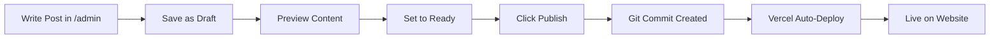

# Decap CMS Implementation - Quick Reference

## ✅ Implementation Complete

Your blog system has been successfully upgraded from hardcoded TypeScript to a dynamic CMS-powered system!

---

## 📁 What Was Installed

### Admin Panel
- **Location**: `/public/admin/`
- **Access**: https://age.fincalcbox.com/admin
- **Files**:
  - `index.html` - Admin UI interface
  - `config.yml` - CMS configuration

### Content Storage
- **Location**: `/content/blog/`
- **Format**: Markdown files with YAML frontmatter
- **Existing Posts**: 3 blog posts migrated successfully

### Dependencies Added
```json
{
  "gray-matter": "^4.0.3",
  "vite-plugin-markdown": "^2.2.0"
}
```

### Code Updates
- **`src/lib/blogLoader.ts`** - New markdown file loader utility
- **`src/data/blogPosts.ts`** - Updated to use dynamic loader
- **`vite.config.ts`** - Added markdown plugin
- **`src/vite-env.d.ts`** - Added TypeScript declarations

---

## 🔧 Required Configuration

> [!IMPORTANT]
> **BEFORE DEPLOYING:** Update your GitHub repository information

**Edit:** `public/admin/config.yml` (line 5)

```yaml
backend:
  name: github
  repo: YOUR_GITHUB_USERNAME/age-calculator-starter  # ← UPDATE THIS
  branch: main
```

**Replace with your actual GitHub repo** (e.g., `johndoe/age-calculator-starter`)

---

## 🚀 Deployment Checklist

### Step 1: Update Repository Info
- [ ] Edit `public/admin/config.yml`
- [ ] Replace `YOUR_GITHUB_USERNAME` with your GitHub username
- [ ] Verify branch name is correct (`main` or `master`)

### Step 2: Commit & Push
```bash
git add .
git commit -m "Added Decap CMS for blog management"
git push origin main
```

### Step 3: Vercel Auto-Deploy
- Vercel detects push and auto-deploys
- Build time: ~2-3 minutes
- New admin panel will be live at `/admin`

### Step 4: Test Admin Access
1. Visit: `https://age.fincalcbox.com/admin`
2. Click "Login with GitHub"
3. Authorize application
4. Verify existing blog posts appear

---

## 📝 How to Add New Blog Posts

### Option 1: Via Admin Panel (Recommended)
1. Go to `/admin`
2. Login with GitHub
3. Click "New Blog Post"
4. Fill in fields
5. Click "Publish"

### Option 2: Manual Markdown File
1. Create new `.md` file in `/content/blog/`
2. Add frontmatter:
```markdown
---
title: "Your Blog Title"
description: "Meta description"
slug: "url-friendly-slug"
date: 2025-12-09
author: "FinCalcBox Team"
readTime: "5 min read"
tags:
  - Tag1
  - Tag2
featuredImage: "/blog-images/image.webp"
---

# Your Content Here
```
3. Commit and push to GitHub

---

## 🔐 Security

### Who Can Access the Admin Panel?

Only users with **repository access** on GitHub:
- Repository owner
- Collaborators
- Team members with write permission

No separate user management needed - GitHub handles authentication.

### Adding New Users

To give someone blog editing access:
1. Go to your GitHub repository
2. Settings → Collaborators
3. Add their GitHub username
4. They can now login to `/admin`

---

## 🧪 Testing the System

### Local Testing

**Option 1: Build and Preview**
```bash
npm run build
npm run preview
# Visit http://localhost:4173/admin
```

**Option 2: Dev Server** (CMS won't fully work, but blog posts will)
```bash
npm run dev
# Visit http://localhost:8080
```

> [!NOTE]
> GitHub OAuth only works on live deployment. Local testing has limitations.

### Production Testing

After deployment:
1. ✅ Visit `/admin` → Should show login page
2. ✅ Login with GitHub → Should see dashboard
3. ✅ View existing posts → 3 migrated posts visible
4. ✅ Create test post → Should create Git commit
5. ✅ Check `/blog` → New post appears after deployment

---

## 📊 Blog Publishing Workflow



**Timeline:**
- Write post: 10-30 minutes
- Click Publish: Instant
- Git commit: 2-5 seconds
- Vercel deploy: 2-3 minutes
- **Total**: ~3 minutes from publish to live

---

## 🎨 Customization Options

### Editorial Workflow

Current setup uses **draft → review → publish** workflow.

To disable (make all posts immediately publishable):
```yaml
# In config.yml, remove this line:
publish_mode: editorial_workflow
```

### Add More Fields

Edit `config.yml` to add custom fields:
```yaml
fields:
  - { label: "Author Bio", name: "authorBio", widget: "text" }
  - { label: "Social Image", name: "socialImage", widget: "image" }
```

### Collection Settings

Current setup:
- **Folder**: `content/blog`
- **Format**: Markdown with frontmatter
- **Sorting**: By date (newest first)
- **Slug**: Custom per post

---

## 🐛 Troubleshooting

### Build Errors

**Error**: `Cannot find module 'gray-matter'`
```bash
npm install gray-matter vite-plugin-markdown
```

**Error**: `Module '*.md' not found`
- Check `src/vite-env.d.ts` has markdown declarations
- Restart dev server

### CMS Not Loading

**Problem**: `/admin` shows blank page

**Check:**
1. `public/admin/index.html` exists
2. `public/admin/config.yml` exists
3. Vercel deployment succeeded
4. No console errors (F12 → Console)

### Posts Not Appearing

**Problem**: Blog posts don't show on `/blog` page

**Check:**
1. Markdown files in `/content/blog/` have correct frontmatter
2. Build completed successfully
3. Cache cleared (Ctrl+Shift+R)
4. Check browser console for errors

---

## 📈 Next Steps

### Immediate
1. ✅ Update `config.yml` with your GitHub repo
2. ✅ Deploy to Vercel
3. ✅ Test admin login
4. ✅ Create first blog post via CMS

### Ongoing
- 📝 Write SEO-optimized blog posts weekly
- 📊 Monitor Google Search Console
- 🔗 Build internal linking between posts
- 📸 Optimize images for fast loading
- 🏷️ Use consistent tagging strategy

### Future Enhancements
- Add content scheduler
- Implement blog categories
- Add author profiles
- Enable comments (e.g., Disqus, Giscus)
- Add related posts section

---

## 📚 Documentation Files

- **User Guide**: `cms_user_guide.md` - For content editors
- **Implementation Plan**: `implementation_plan.md` - Technical details
- **This File**: Quick reference for developers

---

## 🎯 Key Benefits

### Before (Hardcoded)
- ❌ Required coding knowledge
- ❌ Full Git workflow needed
- ❌ 5-10 minute publish time
- ❌ Developer-dependent
- ❌ No draft system

### After (Decap CMS)
- ✅ User-friendly admin panel
- ✅ Click to publish
- ✅ ~3 minute deployment
- ✅ Non-technical users can edit
- ✅ Draft/review/publish workflow
- ✅ Image uploads built-in
- ✅ Preview before publishing
- ✅ Git history preserved

---

## 💬 Support

- **Documentation**: See `cms_user_guide.md`
- **Decap CMS Docs**: https://decapcms.org/docs/
- **GitHub Issues**: Report bugs in your repository
- **Vercel Support**: https://vercel.com/support

---

**Implementation Date**: December 9, 2025  
**Version**: 1.0.0  
**Status**: ✅ Production Ready
